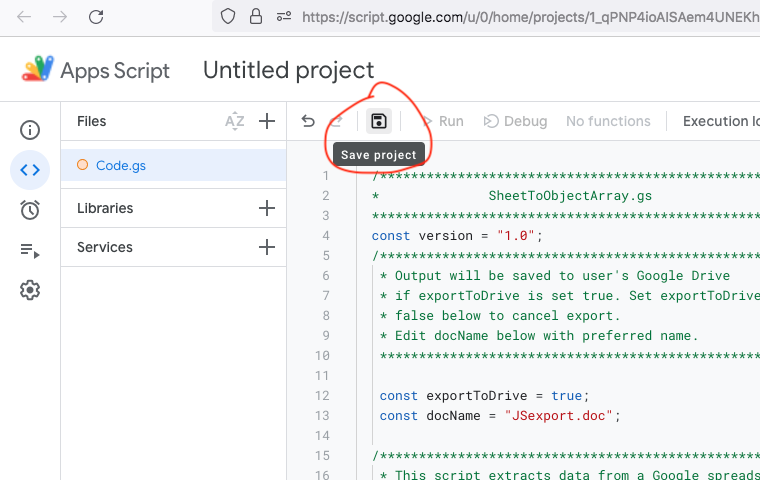

# sheetsToObjectArray.gs

## About

`SheetsToObjectArray.gs` is a Google Apps Script that reads tabular data in a Google spreadsheet and converts it to a javascript array of objects and to equivalent JSON, for use in javascript projects.

## How to Use `sheetsToObjectArray.gs`

For users familiar with Google Apps Scripts, set up is trivial: navigate to the spreadsheet you want to convert and create a linked script using the source code pasted from either of the accompanying files [sheetsToObjectArray.txt](./sheetsToObjectArray_source.txt) and [sheetsToObjectArray.gs](.sheetsToObjectArray_source.gs). Running the script will result in the execution message containing the required code and a copy will be created as a Google Doc in Google Drive.

## Detailed Instructions

1) Navigate to the required Google Sheets spreadsheet in a web browser. Best results are obtained with simple tabular data having a single header row. Like this:


2) From the **Extensions** menu, select **Apps Script**:


3) The new window that opens will contain a new `.gs` page with an empty function named `myFunction()`. Select and delete `myFunction()`:


4) Paste the source code for `sheetsToObjectArray.gs` in the script window (the source code can be copied from [sheetsToObjectArray.txt](./sheetsToObjectArray_source.txt) or [sheetsToObjectArray.gs](./sheetsToObjectArray_source.gs) or from the source code section later in this guide. Once pasted into Apps Script, press the **save** icon:



5) Press the Google Apps Script **run** button to execute the script:


**The first time you run a new script there will be a delay and Google will require you to give permissions for the script to run. Follow the following steps to continue**

6) After several seconds delay, a modal dialigue will appear, click the **review permissions** button to continue:

 

7) Click on the Google account hosting the spreadsheet on the popup window that appears:


8) A window warning that Google hasn't verified the script will appear. Select the **Advanced** link in the lower left of the window:


9) Select the **Go to project (unsafe)** link that appears in the lower left of the window:


10) Finally, click the **Allow** button on the window that appears:


**The script will now execute**

## Output to Apps Script Execution Log

When the script has completed, an **Execution log** will appear. Beneath the 'Execution started' message will be the current data and time and the output of the script:


 Scrolling down will reveal a formatted javascript array of objects representing the table data. There will also be JSON for the same data.

## Output to Google Docs written to Google Drive

The default option for `sheetsToObjectArray.gs` (see **options** below for changing options) will create a new Google Doc in the Drive of the signed in user. 

Navigating to Drive and selecting **Recent** from the left side menu will reveal the file containing the data. The default name for the file is **JSexport.doc** (see **options** below for changing the file name):


Clicking on the **JSexport.doc** file will open it in a new browser tab and reveal the data generated by the script:


## Example Output Array of Objects

```
// javascript array of objects:
const data = [
  {firstName: "John", lastName: "Smith", id: "p01", age: 22, gender: "male", height: 1.81, maritalStatus: "single"}, 
  {firstName: "Gary", lastName: "Player", id: "p02", age: 43, gender: "male", height: 1.79, maritalStatus: "divorced"}, 
  {firstName: "John", lastName: "Angel", id: "po3", age: 35, gender: "male", height: 1.83, maritalStatus: "single"}, 
  {firstName: "Michael", lastName: "King", id: "p04", age: 45, gender: "male", height: 1.79, maritalStatus: "married"}, 
  {firstName: "Sarah", lastName: "Brown", id: "p05", age: 37, gender: "female", height: 1.78, maritalStatus: "married"}, 
  {firstName: "Joan", lastName: "Carick", id: "p06", age: 32, gender: "female", height: 1.6, maritalStatus: "married"}, 
  {firstName: "William", lastName: "Clark", id: "p07", age: 45, gender: "male", height: 1.68, maritalStatus: "married"}, 
  {firstName: "George", lastName: "Last", id: "p08", age: 24, gender: "male", height: 1.86, maritalStatus: "single"}, 
  {firstName: "Peter", lastName: "Howard", id: "p09", age: 39, gender: "male", height: 1.8, maritalStatus: "maried"}, 
  {firstName: "Mary", lastName: "O'Conner", id: "p10", age: 42, gender: "female", height: 1.71, maritalStatus: "single"}, 
  {firstName: "Petula", lastName: "Reed", id: "p11", age: 32, gender: "female", height: 1.56, maritalStatus: "married"}
];
```
The above snippet was copied from the output of the `sheetsToObjectArray.gs` script. It is a valid array declaration where each element is a javascript object representing individual records (rows) of the table data used to generate it. The default array name is **data** - this can be edited to suit the intended purpose.

## Example Output JSON

```
// JSON:
[
  {"firstName": "John", "lastName": "Smith", "id": "p01", "age": 22, "gender": "male", "height": 1.81, "maritalStatus": "single"}, 
  {"firstName": "Gary", "lastName": "Player", "id": "p02", "age": 43, "gender": "male", "height": 1.79, "maritalStatus": "divorced"}, 
  {"firstName": "John", "lastName": "Angel", "id": "po3", "age": 35, "gender": "male", "height": 1.83, "maritalStatus": "single"}, 
  {"firstName": "Michael", "lastName": "King", "id": "p04", "age": 45, "gender": "male", "height": 1.79, "maritalStatus": "married"}, 
  {"firstName": "Sarah", "lastName": "Brown", "id": "p05", "age": 37, "gender": "female", "height": 1.78, "maritalStatus": "married"}, 
  {"firstName": "Joan", "lastName": "Carick", "id": "p06", "age": 32, "gender": "female", "height": 1.6, "maritalStatus": "married"}, 
  {"firstName": "William", "lastName": "Clark", "id": "p07", "age": 45, "gender": "male", "height": 1.68, "maritalStatus": "married"}, 
  {"firstName": "George", "lastName": "Last", "id": "p08", "age": 24, "gender": "male", "height": 1.86, "maritalStatus": "single"}, 
  {"firstName": "Peter", "lastName": "Howard", "id": "p09", "age": 39, "gender": "male", "height": 1.8, "maritalStatus": "maried"}, 
  {"firstName": "Mary", "lastName": "O'Conner", "id": "p10", "age": 42, "gender": "female", "height": 1.71, "maritalStatus": "single"}, 
  {"firstName": "Petula", "lastName": "Reed", "id": "p11", "age": 32, "gender": "female", "height": 1.56, "maritalStatus": "married"}
];
```

The above snippet was copied from the output of the `sheetsToObjectArray.gs` script. It is valid JSON text that can be used directly in javascript projects.

## Features

The object arrays written by `sheetsToObjectArray.gs` use the table header titles as the object keys. Valid object keys are created by removing spaces from the titles and reformatting them as camelCase single words.

String values in the table are written as double-quotted strings in the objects while integer and float numbers are written unquotted. 

Although best avoided, any double quote marks forming part of a value in the table are escaped with back-slashes in the object values, allowing them to be retained and correctly interpretted in subsequent javascript processes.

The key names in the JSON are written as double-quotted strings.

## Options

### Preventing Export to Google Drive

If the user wishes to prevent the output being written to a Google Doc on Drive, a boolean value `exportToDrive` can be set to `false` in the source code. See image below for location in script. (remember to save the script after making any edits).

### Changing the Output Google Doc Filename

The default filename of the exported Google Doc is **JSexport.doc**. This can be changed by editing the `docName` variable in the source code (remember to save the script after making any edits).

**the `exportToDrive` and `docName` variables are located near to the top of the script for easy editing:**


### Annotating the Output

A user may include a message in the output by writing it into an empty variable named `notes` in the source code. The `notes` declaration can be found below the comment block preceding the main `sheetToObjectArray()` function, towards the top of the script:


Remember to save the script after making any edits.

If a message is added to the `notes` variable, it will be included in the output after the spreadsheet details.

## `sheetsToObjectArray.gs` source code

```
  /******************************************************* 
  *              SheetToObjectArray.gs                   *
  *******************************************************/
  const version = "1.0";
  /*******************************************************
   * Output will be saved to user's Google Drive 
   * if exportToDrive is set true. Set exportToDrive
   * false below to cancel export.
   * Edit docName below with preferred name.
   *******************************************************/
   
   const exportToDrive = true;
   const docName = "JSexport.doc";

  /*******************************************************
   * This script extracts data from a Google spreadsheet
   * and outputs it as a formatted javascript object array
   * and as JSON. 
   * To use, open a new Apps Script from the Extensions
   * menu of the spreadsheet to be extracted, paste this 
   * entire code, save, and run.
   * The output can be copied from the execution log
   * message on the Apps Script page, or retrieved from the
   * new Google Doc created in the Drive of the logged-in 
   * user.
   * *****************************************************/

   /*******************************************************
    * User Comments to be included in output can be added
    * to the notes variable below:
   * *****************************************************/

   const notes = ``;


function sheetToObjectArray() {

  const appUrl = SpreadsheetApp.getActiveSpreadsheet().getUrl();
  const appId = SpreadsheetApp.getActiveSpreadsheet().getId();
  const appSheetName = SpreadsheetApp.getActiveSpreadsheet().getSheetName();
  const appName = SpreadsheetApp.getActiveSpreadsheet().getName();
  
  let outputTitle = "Javascript Object Array and JSON data Extracted from Google Spreadsheet\n";
  let sheetDetails= `Spreadsheet url - ${appUrl}\n\nSpreadsheet name - ${appName} (sheet name - ${appSheetName})\n`;
  let info = `Data extracted using SheetToObjectArray.gs (version ${version}), a Google Apps Script utility created by David Pritlove.\nGithub Repository: \n\n`;

  const currentSheet = SpreadsheetApp.getActiveSheet();
  const rows = currentSheet.getRange(2,1,(currentSheet.getLastRow()-1),currentSheet.getLastColumn()).getValues();  
    if (rows[0][rows[0].length-1] == "") {
      for (let row=0; row<rows.length; row++) {rows[row].pop()}
    }
  const headData = currentSheet.getRange(1,1,1,rows[0].length).getValues(); 
  const head = headData[0].map(x => camelize(x));

  let jsObjectArray = "\n// javascript array of objects:\nconst data = [";
  let json = "// JSON:\n["

    for (let row=0; row<rows.length; row++) {
      jsObjectArray += "\n  {";
      json += "\n  {";

      for (let col=0; col<rows[0].length; col++) {
          if (rows[row][col] == parseFloat(rows[row][col])) {
            jsObjectArray += `${head[col]}: ${rows[row][col]}`;
            json += `"${head[col]}": ${rows[row][col]}`;
          }
          else {
            jsObjectArray += `${head[col]}: "${clean(rows[row][col].toString())}"`;
            json += `"${head[col]}": "${clean(rows[row][col].toString())}"`;
          }
        

        if(col == rows[0].length-1) {jsObjectArray += "}"; json += "}"} // end if last col;
        else {jsObjectArray += ", "; json += ", ";} // end else last col;

      } // next col;

    if (row == rows.length-1) {jsObjectArray += "\n];"; json += "\n];"} // end if last row;
    else {jsObjectArray += ", "; json += ", ";} // end else last row;

    } // next row;

  
  let date = new Date().toString();

  // output to Apps Script log;
  Logger.log(date + "\n\n" + outputTitle + "\n\n" + sheetDetails + "\n\n" + notes + "\n\n" + jsObjectArray + "\n\n" + json + "\n\n" + info);

  if (exportToDrive) {

  // output to Google Doc in Drive;
  const fileName = docName || "JSexport.doc";
  const newDoc = DocumentApp.create(fileName);
  const doc = DriveApp.getFileById(newDoc.getId());
  const body = DocumentApp.openById(newDoc.getId()).getBody();

  let style = {};
  style[DocumentApp.Attribute.HORIZONTAL_ALIGNMENT] = DocumentApp.HorizontalAlignment.LEFT;
  style[DocumentApp.Attribute.FONT_FAMILY] = 'Courier New';
  style[DocumentApp.Attribute.FONT_SIZE] = 12;
  style[DocumentApp.Attribute.UNDERLINE] = true;

  let titleLine = body.appendParagraph(outputTitle);
  titleLine.setAttributes(style);


  let dateLine = body.appendParagraph(date + "\n");
  let detailsLine = body.appendParagraph(sheetDetails);
  style[DocumentApp.Attribute.UNDERLINE] = false;
  dateLine.setAttributes(style);
  detailsLine.setAttributes(style);

  if (notes.length > 0) {
    let notesLine = body.appendParagraph(notes + "\n")
    notesLine.setAttributes(style);
  } // end if notes;

  let arrayLine = body.appendParagraph(jsObjectArray);
  style[DocumentApp.Attribute.FONT_SIZE] = 10;
  arrayLine.setAttributes(style);

  let jsonLine = body.appendParagraph("\n\n" + json);
  jsonLine.setAttributes(style);

  let infoLine = body.appendParagraph("\n\n" + info)
  style[DocumentApp.Attribute.FONT_SIZE] = 12;
  style[DocumentApp.Attribute.ITALIC] = true;
  infoLine.setAttributes(style);

  } // end if exportToDrive;

} // end createDataObjectArray function;

function clean(val) {
  // backslash-escapes double quote marks in passed string;
  return val.replace(/"/g, '\\"');
}

function camelize(str) {
  // function returns the camelCase version of the passed string;
  // see https://stackoverflow.com/questions/2970525/converting-any-string-into-camel-case
  // Christian C. Salvadó's answer to SO question;

  return str.replace(/(?:^\w|[A-Z]|\b\w|\s+)/g, function(match, index) {
    if (+match === 0) return ""; // or if (/\s+/.test(match)) for white spaces
    return index === 0 ? match.toLowerCase() : match.toUpperCase();
  });
} // end camelize function;


```

